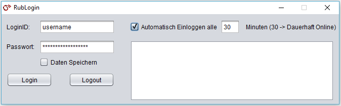

# RUB Login
An automatic login client for the RUB internet access written in Java

## Abstract
A login client for the RUB university internet access. 
Necessary to stay connected since clients in student housings are kicked after being online for 24 hours. Username and password are encrypted and
saved locally for convenience.

## Installation
Requirements: Java runtime environment (JRE)

Either make your own java project with the source code and export a .jar file OR **simply use the existing one in this repository**

## Screenshot

	

